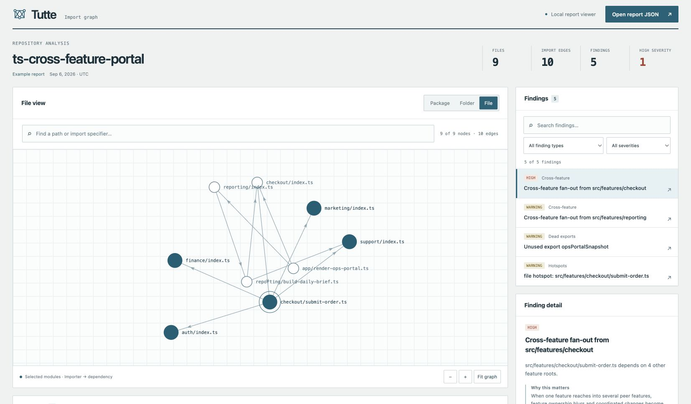
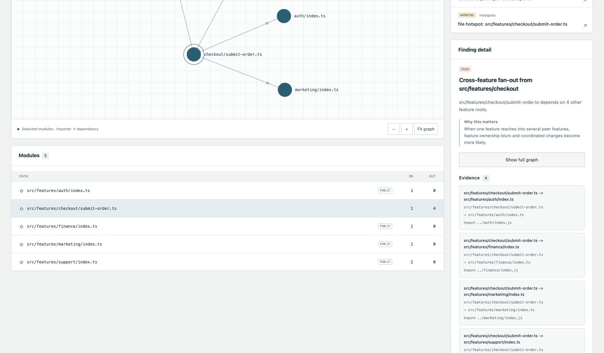

# Import Graph

Analyze imports in a TypeScript or JavaScript repository. Inspect file, folder, and package dependencies; check configured boundaries; compare findings between Git refs.

[Live demo](https://dicnunz.github.io/demos/boundary-atlas/) · [Sample reports](docs/samples/README.md)



## Run

Requires Node 20+ and npm 10.

```bash
npm install
npm run build
node packages/cli/dist/index.js analyze ./fixtures/ts-cycle-dashboard \
  --json ./output/ts-cycle-dashboard.json \
  --markdown ./output/ts-cycle-dashboard.md
```

Replace the fixture path with your repository. Analysis runs locally using `ts-morph`; report files are never uploaded. The CLI and configuration retain the `boundary-atlas` name.

## Findings

| Check | Evidence |
| --- | --- |
| Cycles | Strongly connected components |
| Deep imports | Imports bypassing a public entrypoint |
| Boundaries | Edges outside configured allow-lists |
| Cross-feature dependencies | Imports across peer features |
| Unused exports | No internal references outside public entrypoint surfaces |
| Fan-in and fan-out | Incoming and outgoing dependency counts |

Findings describe static source relationships within the analyzed repository. An unused-export finding does not establish that external consumers never use an export. Entrypoint and boundary configuration affect the results.

The viewer lets you follow a module's dependencies, isolate a finding, and open a local JSON report. [Configuration and export instructions](docs/usage.md) cover boundary rules and the offline HTML viewer.



## Compare revisions

```bash
node packages/cli/dist/index.js diff . \
  --base HEAD~1 \
  --head HEAD \
  --json ./output/self-drift.json \
  --markdown ./output/self-drift.md
```

Both refs must exist in the target repository. The report records findings and hotspots added or removed between them.

## Check

```bash
npm run verify
npx playwright install chromium
npm run e2e
```

Verification includes fixture analysis and analysis of this repository. [Saved outputs](docs/samples/README.md) show the inputs and resulting findings. The browser tests run separately. This is an AI-assisted personal project; these examples and tests do not establish production use.
